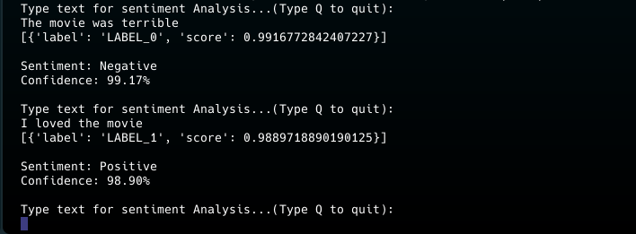

# Sentiment analysis AI test application

A Python terminal-based LLM app for sentiment analysis.
This application uses a transformers sentiment analysis model  for training on IMDb datasets 
to test whether user input  about the data is positive or negative.

